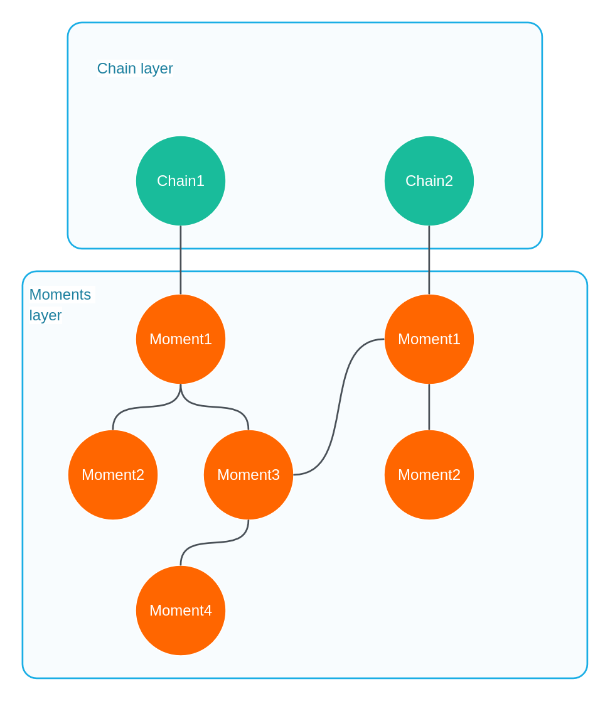

# Architecture

## Basic definitions
 - Chain — an ordered sequence of moments united by a common context
 - Moment — an atomic unit of memory (a single interaction/event)

## Basic Architecture 
The architecture consists of two layers:
 - Chain layer (Chains)
 - Moment layer (Moments)

Each layer is represented by its own [vector space](https://ru.wikipedia.org/wiki/%D0%92%D0%B5%D0%BA%D1%82%D0%BE%D1%80%D0%BD%D0%BE%D0%B5_%D0%BF%D1%80%D0%BE%D1%81%D1%82%D1%80%D0%B0%D0%BD%D1%81%D1%82%D0%B2%D0%BE).
In the Chains vector space, points store shared data about the chain and a set of moment IDs (in [UUID v7](https://en.wikipedia.org/wiki/Universally_unique_identifier#Version_7_(timestamp_and_random)) format)

In the Moments vector space, **ALL** moment points are stored; these moments can be connected to each other as a multidimensional graph

### Architecture Scheme
